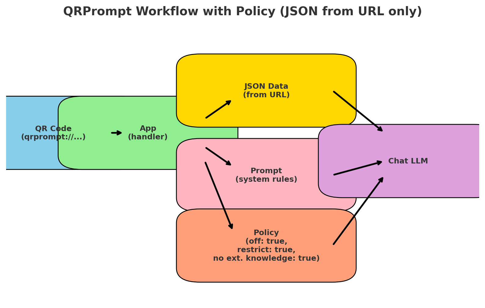

📌 QRPrompt – QR Codes with Restricted AI Prompts
🎯 Project Goal

QRPrompt is an open standard where a QR code on a product or object opens an AI app (e.g., ChatGPT, Grok) with a predefined system prompt.
The AI runs in “fact-only” mode – it uses only the JSON data provided by the manufacturer.
If the information is missing, the AI must refuse to answer.

✅ Benefits

No hallucinations

Fast access to reliable product data

Safer use for medicine, food, childcare

Interactive help instead of static manuals

🔗 QR Link Format

A single scan/click opens the QRPrompt handler, loads only the provided JSON data, and runs the AI in restricted mode (no internet, no external knowledge).

Syntax:

<pre><code>qrprompt://run?payload=&lt;base64url(JSON)&gt;</code></pre>

<ul>
  <li><code>payload</code> = JSON encoded with Base64URL (UTF-8, no <code>=</code> padding)</li>
  <li>Use URL-safe Base64 (<code>-</code> and <code>_</code> instead of <code>+</code> and <code>/</code>)</li>
</ul>

<h2>Example JSON (before base64url)</h2>
<pre><code>{
  "version": "1.0",
  "command": "qrprompt",
  "meta": {
    "product_name": "Widget X"
  },
  "data": [
    { "mode": "url", "type": "json", "url": "https://example.com/product.json" },
    { "mode": "url", "type": "json", "url": "https://example.com/leaflet.json" },
    { "mode": "url", "type": "json", "url": "https://example.com/nutrition.json" }
  ],
  "policy": {
    "offline_only": true,
    "restrict_to_input": true,
    "disallow_external_knowledge": true
  },
  "prompt": {
    "system": "You are an assistant restricted to the provided JSON data. Do not browse the internet or use external knowledge. If data is missing, answer exactly: 'Not provided'. After loading the data, do not summarize or answer yet. Your first message must be exactly: \"Waiting for your questions about '{{product_name}}'?\". During the conversation, answer only from the input data."
  }
}
</code></pre>

<h2>Workflow</h2>

  

<h2>Example Use Case — Food Products</h2>
<ul>
  <li>Context strictly limited to product JSON (ingredients, calories, allergens…)</li>
  <li>Typical questions: “How much protein per serving?”, “Does it contain gluten?”, “Is it vegan?”</li>
  <li>AI refuses when data is missing (“Not provided”).</li>
</ul>

<h2>Other Applications</h2>
<ul>
  <li><strong>Medicine</strong> — dosage, side effects, contraindications (with doctor referral)</li>
  <li><strong>Electronics/Appliances</strong> — manuals, error codes, accessories</li>
  <li><strong>Books</strong> — summaries, motifs, related authors</li>
  <li><strong>Travel</strong> — attractions, maps, local transport</li>
  <li><strong>Museums/Zoo</strong> — history, facts, education</li>
  <li><strong>Fashion</strong> — fabric composition, washing, styling</li>
  <li><strong>Furniture</strong> — assembly, cleaning, arrangements</li>
  <li><strong>Cosmetics</strong> — ingredients, allergy safety</li>
  <li><strong>Toys/Games</strong> — rules, variants, FAQ</li>
  <li><strong>Plants</strong> — watering, sunlight, diseases</li>
  <li><strong>Cars</strong> — dashboard lights, servicing, specs</li>
  <li><strong>Events</strong> — program, artists, venue maps</li>
  <li><strong>Finance/Contracts</strong> — policies, conditions, procedures</li>
</ul>

<h2>Vision</h2>

  We believe AI interactions should be as easy as scanning a QR code—bringing
  safety, transparency, and interactivity to everyday products.

